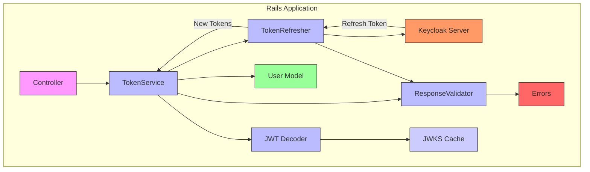
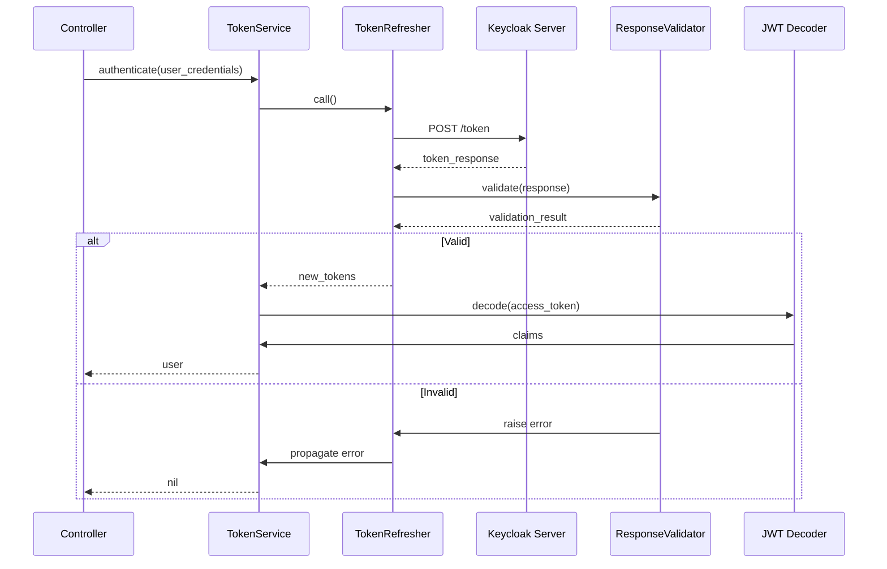

# Description

This library is designed to use Keycloak identification in Rails application

## Installation

Add to Gemfile

```bash
gem "keycloak_ruby", git: "https://github.com/sergey-arkhipov/keycloak_ruby.git"

```

Now under active development, so you need create manually:

```ruby
# ApplicationController
  def jwt_service
    @jwt_service ||= KeycloakRuby::TokenService.new(session)
  end

  def authenticate_user!
    redirect_to login_path unless current_user&.active?
  end

  def current_user
    @current_user ||= jwt_service.find_user
  end

# SeesionController
  def login
    render :login, layout: "login"
  end

  def create
    auth_info = request.env["omniauth.auth"]
    jwt_service.store_tokens(auth_info[:credentials])
    user = User.find_by(email: auth_info.dig(:info, :email))
    return destroy unless user&.active?

    redirect_to root_path, notice: I18n.t("user.auth_success")
  end

  def destroy
    id_token = session[:id_token]
    jwt_service.clear_tokens
    logout_url = "#{KeycloakRuby.config.logout_url}?post_logout_redirect_uri=#{CGI.escape(root_url)}&" \
                 "id_token_hint=#{id_token}"

    redirect_to logout_url, allow_other_host: true
  end

```

It is assumed that you have a User model in Rails app

## Architecture Overview

### Component Diagram



### Authentication Sequence



### Key Flows

1. **Initial Authentication**:

   - Controller → TokenService → Keycloak Server
   - Stores tokens in session

2. **Token Refresh**:

   - TokenService → TokenRefresher → Keycloak Server
   - Automatic when token expires

3. **Access Validation**:

   - Verifies token signature and claims
   - Checks user existence in local DB

4. **Error Handling**:
   - Clear sessions on invalid tokens
   - Propagates meaningful errors

```

```

```

```
