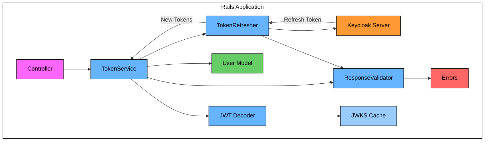
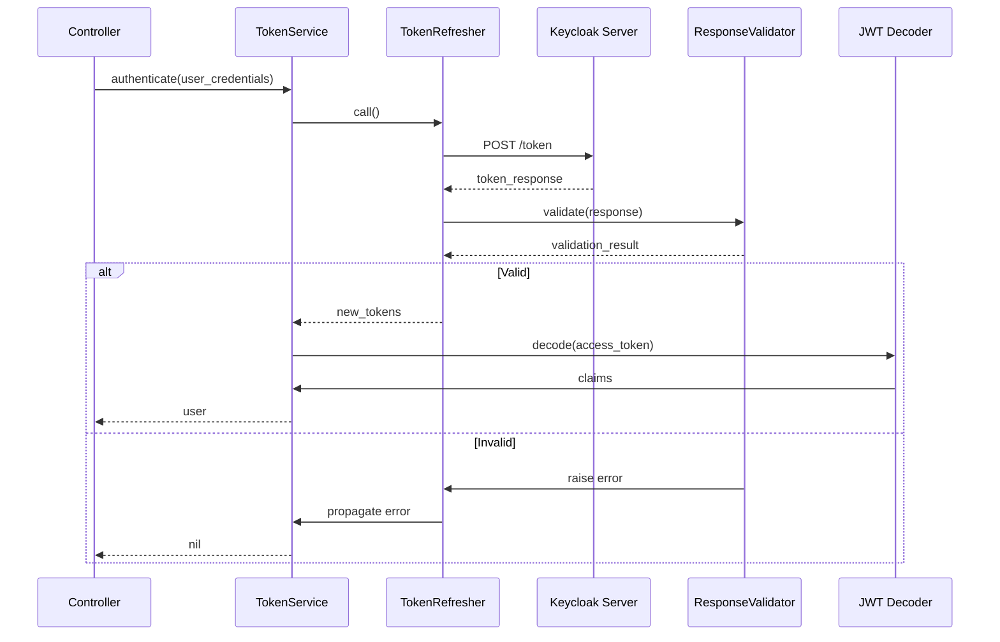

# Description

This library is designed to use Keycloak identification in Rails application

## Installation

Add to Gemfile

```bash
gem "keycloak_ruby", git: "https://github.com/sergey-arkhipov/keycloak_ruby.git"

```

Create initializer for omniauth manually or use generator (config/initializers/omniauth.rb)

```bash
rails generate keycloak_ruby:install
```

Now under active development, so you need create manually:

```ruby
# ApplicationController

  include KeycloakRuby::Authentication

# SeesionController
  def login
    render :login, layout: "login"
  end

  def create
    auth_info = request.env["omniauth.auth"]
    keycloak_jwt_service.store_tokens(auth_info[:credentials])
    user = User.find_by(email: auth_info.dig(:info, :email))
    return destroy unless user&.active?

    redirect_to root_path, notice: I18n.t("user.auth_success")
  end

  def destroy
    id_token = session[:id_token]
    keycloak_jwt_service.clear_tokens
    logout_url = "#{KeycloakRuby.config.logout_url}?post_logout_redirect_uri=#{CGI.escape(root_url)}&" \
                 "id_token_hint=#{id_token}"

    redirect_to logout_url, allow_other_host: true
  end

# config/routes.rb
get '/login', to: 'sessions#login', as: :login
get '/auth/:provider/callback', to: 'sessions#create'
delete '/logout', to: 'sessions#destroy', as: :logout

```

It is assumed that you have a User model in Rails app

### Configuration Warning

When using `ENV[...]` or `ENV.fetch(...)` inside your `config/keycloak.yml`, make sure the referenced environment variables are actually defined.

If any variable is missing, the application may crash at boot time with one of the following exceptions:

- `KeyError` - when using `ENV.fetch(...)` without a fallback default;
- `KeycloakRuby::Errors::ConfigurationError` - when a required value is `nil` or blank after config evaluation.

This issue can happen  when building Docker images. To avoid this, **use safe defaults** via `ENV.fetch('VAR', 'fallback')`:

```yaml
production:
   keycloak_url: <%= ENV.fetch('KEYCLOAK_URL', 'https://keycloak.example.com') %>
   app_host: <%= ENV.fetch('DEFAULT_APP_HOST', 'https://app.example.com') %>
   realm: <%= ENV.fetch('KEYCLOAK_REALM', 'my-realm') %>
   admin_client_id: <%= ENV.fetch('KEYCLOAK_ADMIN_CLIENT_ID', 'admin-cli') %>
   admin_client_secret: <%= ENV.fetch('KEYCLOAK_ADMIN_CLIENT_SECRET', 'changeme') %>
   oauth_client_id: <%= ENV.fetch('KEYCLOAK_OAUTH_CLIENT_ID', 'my-client') %>
   oauth_client_secret: <%= ENV.fetch('KEYCLOAK_OAUTH_CLIENT_SECRET', 'secret') %>
```

## Architecture Overview

### Component Diagram



### Authentication Sequence



### Key Flows

1. **Initial Authentication**:

   - Controller → TokenService → Keycloak Server
   - Stores tokens in session

2. **Token Refresh**:

   - TokenService → TokenRefresher → Keycloak Server
   - Automatic when token expires

3. **Access Validation**:

   - Verifies token signature and claims
   - Checks user existence in local DB

4. **Error Handling**:
   - Clear sessions on invalid tokens
   - Propagates meaningful errors

```

```

## Test

For test purpose there mock helper sign_in(user)

- add `require "keycloak_ruby/testing/keycloak_helpers"` to keycloak_helper.rb
- add sign_in in tests `config.include KeycloakRuby::Testing::KeycloakHelpers`

```

```
