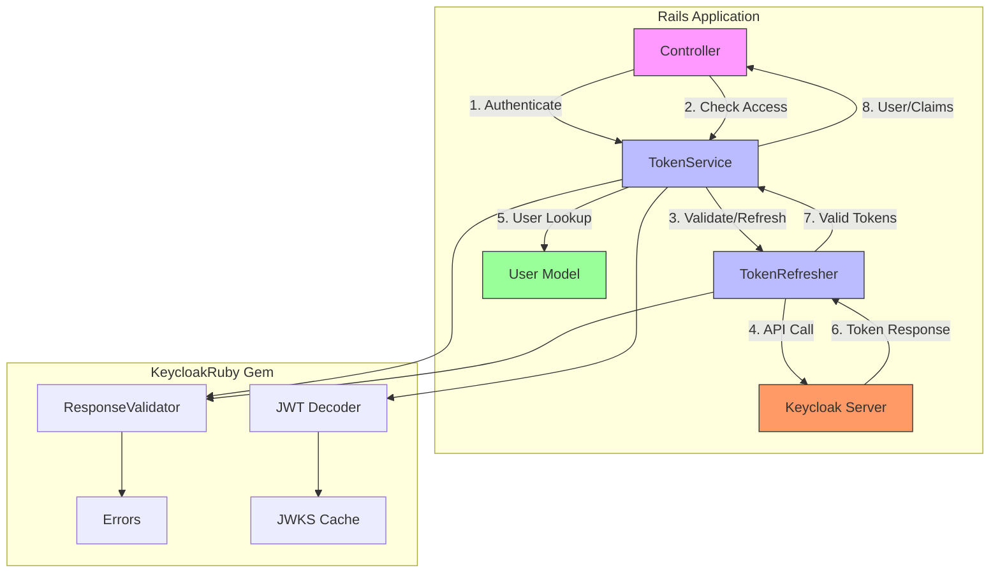

## Architecture Overview

### Component Diagram



### Authentication Sequence


### Key Flows

1. **Initial Authentication**:

   - Controller → TokenService → Keycloak Server
   - Stores tokens in session

2. **Token Refresh**:

   - TokenService → TokenRefresher → Keycloak Server
   - Automatic when token expires

3. **Access Validation**:

   - Verifies token signature and claims
   - Checks user existence in local DB

4. **Error Handling**:
   - Clear sessions on invalid tokens
   - Propagates meaningful errors

```

```
